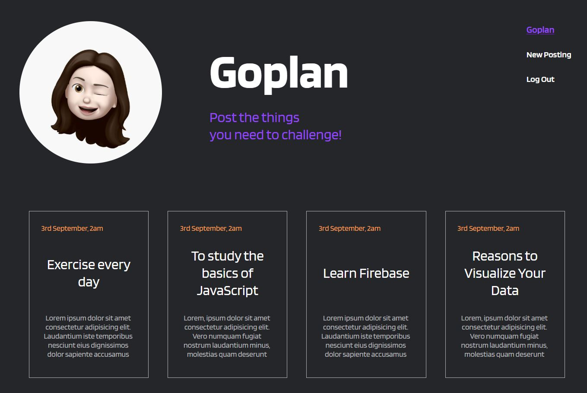

# Goplan

도전해야 하는 일들을 포스팅하고 실현하세요!

Live - https://goplan-810d7.firebaseapp.com/signin

### React & FireBase SPA

Redux로 사용자 인증 상태와 프로젝트 생성 상태관리를 했습니다.
FireBase를 사용해 회원가입, 로그인 기능을 구현하고 호스팅을 연결했습니다.

## Learn

- React
- Redux
- Firebase
- React classComponent

## Tools

- React & Redux
- Redux - thunk
- Scss

## Skills

- 로그인 기능
- 회원가입 기능
- 실시간 데이터 상태 업데이트 기능
- 포스팅 읽기, 생성 기능
- Firebase 호스팅 연결

## 과정

[[ Goplan ] - React Component 생성](https://velog.io/@smooth97/-Goplan-React-Component-%EC%83%9D%EC%84%B1)

[[ Goplan ] - Redux & Firbase 연동 (Error 해결)](https://velog.io/@smooth97/-Goplan-Redux-Firbase-%EC%97%B0%EB%8F%99)

[[ Goplan ] - Redux & Firebase Auth 인증](https://velog.io/@smooth97/-Goplan-Redux-Firebase-Auth)

[[ Goplan ] - Firebase 호스팅 연결](https://velog.io/@smooth97/2019-10-20-0910-%EC%9E%91%EC%84%B1%EB%90%A8-3uk1y93s0h)
